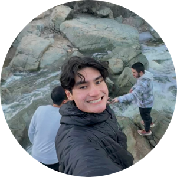
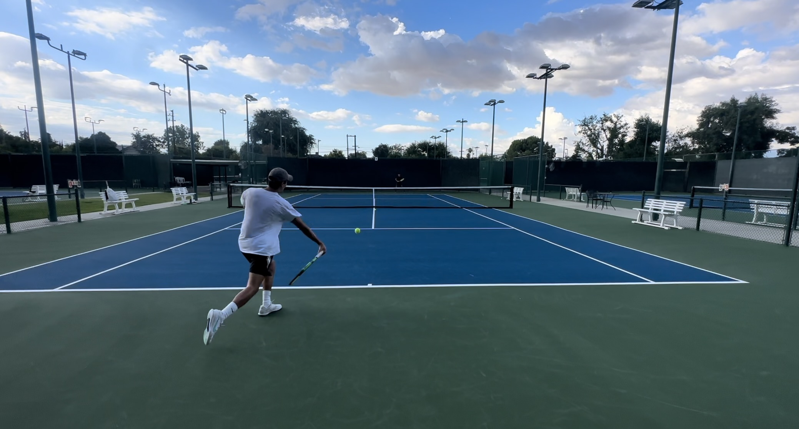
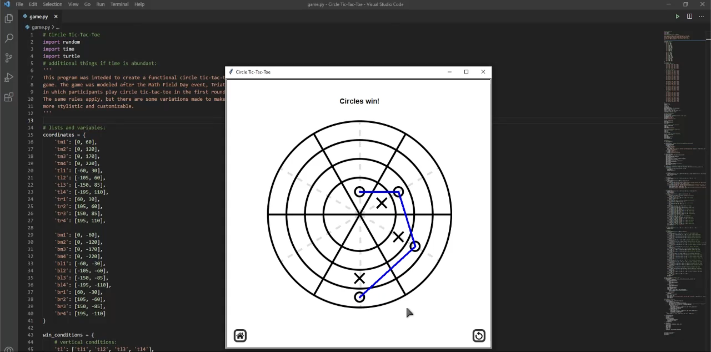

> *Knowing yourself is the beginning of all wisdom.*
>
> –Aristotle

## Contents
  1. [About Me](#about-me)
  2. [Coding Background](#coding-background)
  3. [2024 Goals](#2024-goals)

## About Me

Hi! You've found my Github User Page! I'm a third year Math-CS student at the Universtiy of California, San Diego. I've been coding for about 4 years now, and have been learning new things everyday! My favorite things to do in the my free time are all kinds of outdoor activities, especially sports. I'm very passionate about tennis, and recently volleyball since coming to college. 

*[August 22, 2023](images/tennis.jpeg)*

If you'd like to see more of me playing tennis, I have a few [YouTube](https://www.youtube.com/@derekstennis) videos posted if you want to check them out.

## Coding Background

I first started coding in my senior year of high school when I took AP Computer Science Principles in Python. It was a really fun class, even during the pandemic, and I learned a lot. My favorite project from the class was making a game similar to Tic-Tac-Toe, but played on a circular board.

*[November 11, 2021](images/game.jpeg)*

Python Libraries Used:
- `random`
- `time`
- `turtles`

## 2024 Goals

There are several things I want to accomplish or stay on top of during this year. Here are most of them

- [ ] Ask for help more often
- [ ] Start and complete a personal project
- [ ] Start my day early
- [ ] Start assignments the day they release
- [ ] Attend all my classes

